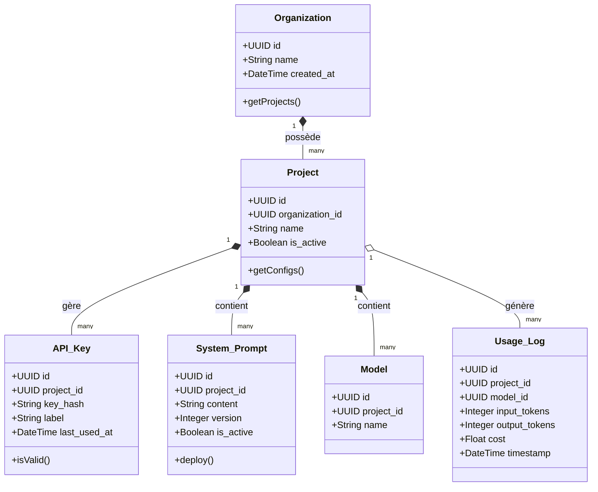
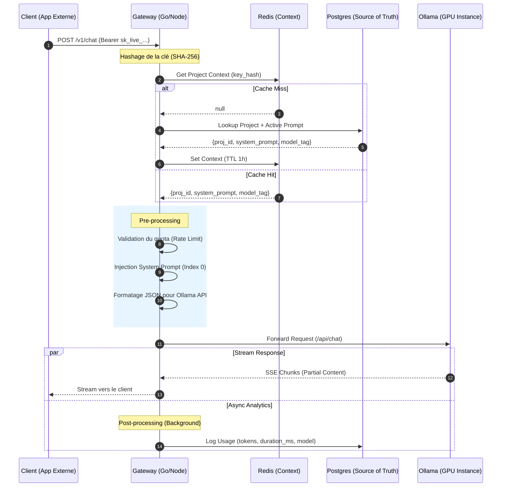
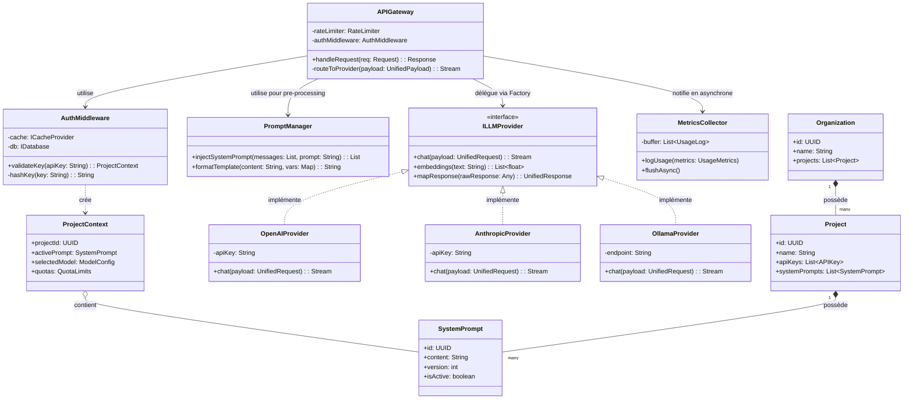

**Version :** 1.0

**Objectif :** Fournir une interface unifiée pour interagir avec divers LLM tout en gérant l'isolation par projet, l'authentification par clé API et l'injection de prompts système.

---

## 1. Architecture Système

L'application repose sur une architecture en couches (Layered Architecture) pour séparer la logique de routage de la logique métier (gestion des prompts) et de l'intégration des fournisseurs.

## Composants Principaux

- **API Gateway (Entry Point) :** Gère les requêtes entrantes, la terminaison TLS et le rate-limiting global.
    
- **Auth & Context Provider (Middleware) :** Valide la clé API, identifie le projet associé et charge les configurations (System Prompt).
    
- **Provider Engine (Adapter Pattern) :** Traduit la requête unifiée vers le format spécifique du fournisseur (OpenAI, Anthropic, Google, etc.).
    
- **Observability Layer :** Enregistre les métriques (tokens, latence, coûts) de manière asynchrone pour ne pas ralentir la réponse.
    

---

## 2. Modèle de Données (Schéma ERD)

Le cœur de votre logique repose sur la hiérarchie suivante :

---

## 3. Spécifications du Flux de Requête

Voici le cycle de vie d'une requête dans votre Gateway :

---

## 4. Stratégie de Tests

Pour garantir la stabilité, le projet doit suivre la pyramide des tests :

### Tests Unitaires (Focus : Logique interne)

- **Parser de Prompt :** Vérifier que l'injection du prompt système ne corrompt pas la structure JSON.
    
- **Générateur de Hash :** S'assurer que les clés API sont correctement hashées avant stockage.
    

### Tests d'Intégration (Focus : Communication)

- **Mock Providers :** Simuler une réponse 429 (Too Many Requests) d'OpenAI et vérifier que la Gateway bascule bien sur le fournisseur de backup (Fallback).
    
- **Persistence :** Vérifier qu'une clé supprimée en base de données rejette immédiatement les appels.
    

### Tests de Performance

- **Latence d'overhead :** La Gateway ne doit pas ajouter plus de **20-50ms** à la requête originale.
    

---

## 5. Sécurité et Performances

- **Sécurité des Clés :** Ne stockez jamais les clés API de vos projets en clair. Utilisez un hash (type SHA-256) pour la comparaison. Chaque clef doit avoir une durée de vie.
    
- **Caching :** Utilisez **Redis** pour mettre en cache les associations `Clé API -> Projet -> System Prompt` afin d'éviter une requête SQL à chaque appel.
    
- **Timeout :** Configurez des timeouts stricts (ex: 30s) pour éviter que des requêtes LLM suspendues ne bloquent vos ressources serveur.
    
## Schéma global

