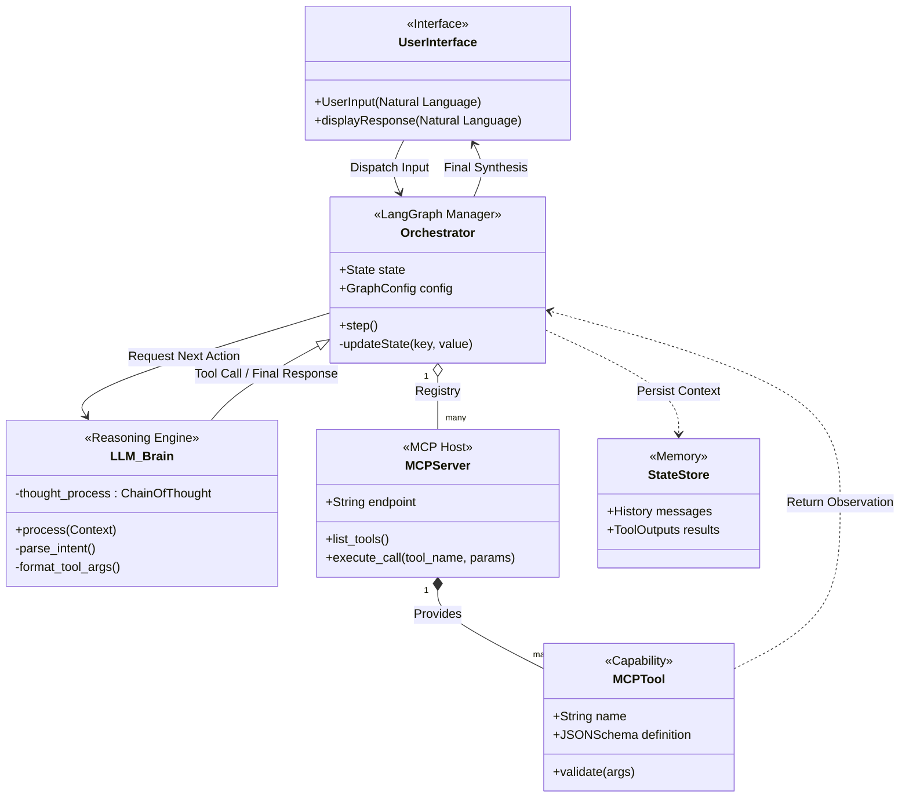
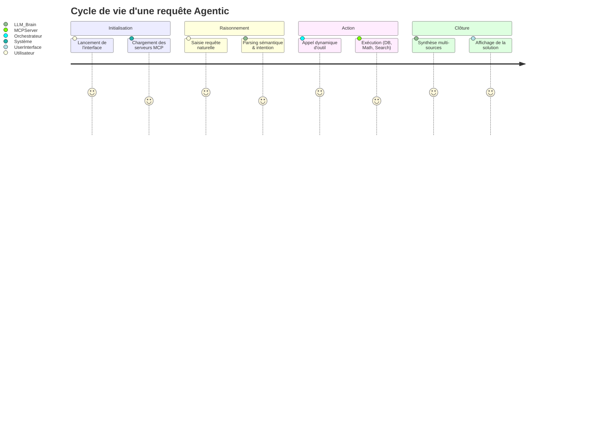

# 🤖 Agentic Framework

**Agentic** est un orchestrateur d'IA de nouvelle génération. Il combine la puissance des graphes d'états de **LangGraph** avec la flexibilité du **Model Context Protocol (MCP)** pour créer des agents autonomes capables d'interagir avec des bases de données, des systèmes de fichiers et des outils de calcul complexes.

---

## 🏗️ 1. Architecture du Système

Le framework repose sur une architecture découplée en trois couches : la **Perception** (UI), le **Raisonnement** (LangGraph + LLM) et l'**Action** (MCP Servers).

### Schéma de Classes





---

## 🔄 2. Flux de Travail & Expérience Utilisateur

Contrairement aux chatbots linéaires, Agentic utilise une **boucle de rétroaction active**. L'agent n'arrête pas son exécution tant que l'objectif n'est pas atteint ou qu'une limite d'itérations n'est pas rencontrée.

### Parcours de Données (User Journey)

Extrait de code



---


## 🧩 3. Composants Clés

|**Composant**|**Rôle**|**Emplacement**|
|---|---|---|
|**Orchestrateur**|Gestionnaire d'état (`State`) et routage logique.|`graph/langraph.py`|
|**Serveurs MCP**|Micro-services exposant des capacités spécifiques.|`mcp/*.py`|
|**Tools**|Fonctions atomiques avec schémas JSON pour le LLM.|`tools/`|
|**UI Layer**|Points d'entrée (Terminal, Web, Desktop).|`ui/`, `main.py`, `webapp.py`|

### Focus sur les Serveurs MCP

- **`database_server.py`** : Interface d'accès aux données.
    
- **`computer_server.py`** : Automatisation système et fichiers.
    
- **`math_server.py`** : Moteur de calcul déterministe.
    
- **`initialisation.py`** : Registre central des capacités de l'agent.
    

---

## 🛠️ 4. Guide de Développement (uv)

Nous utilisons **uv** pour garantir des performances de build 10x supérieures à pip et une reproductibilité totale.

### Installation Rapide

Bash

```
# Synchronisation de l'environnement et des dépendances
uv sync
```

### Ajouter une Capacité (New Tool)

1. **Création** : Créez `mcp/mon_outil.py`.
    
2. **Documentation** : Utilisez des _docstrings_ Python rigoureuses. Le LLM les utilise pour comprendre **quand** appeler votre outil.
    
3. **Enregistrement** : Déclarez votre serveur dans `mcp/initialisation.py`.
    

### Validation

Toujours valider la chaîne de liaison avant de déployer :

Bash

```
uv run python test.py
```

---

## 🖥️ 5. Interfaces Disponibles

Le projet est agnostique à l'interface. Choisissez celle adaptée à votre workflow :

- **Mode Commando** : `uv run python main.py` (CLI rapide)
    
- **Mode Analytics** : `uv run streamlit run webapp.py` (Web UI avec graphs)
    
- **Mode Standalone** : `uv run python desktop.py` (Application fenêtrée)
    

---

> **Note :** Le système de parsing est hybride. La **sémantique** est gérée par le LLM (interprétation), tandis que la **syntaxe** est validée par le schéma MCP (typage strict).
